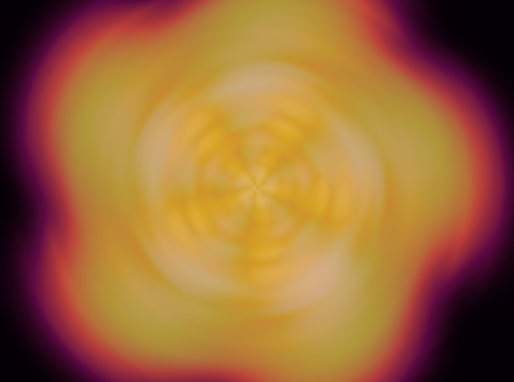
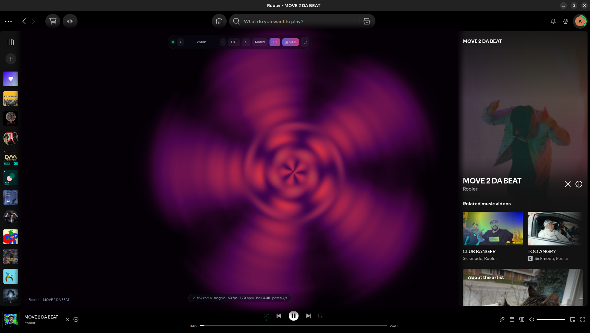
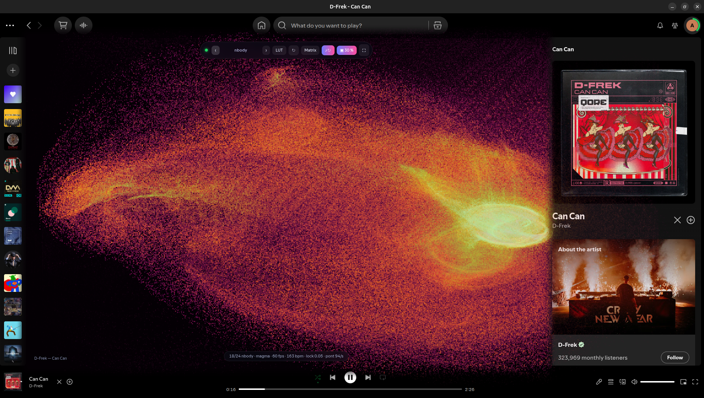
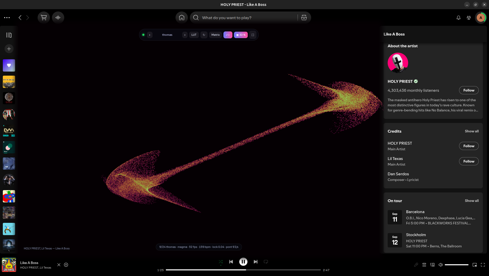

<h1 align="center">Vizualizer</h1>

<p align="center">
  A real-time WebGL2 audio visualizer inside Spotify, as a <a href="https://spicetify.app">Spicetify</a> custom app.<br>
  <b>24 modes</b> · an audio→visual <b>mod matrix</b> · driven by the sound <b>actually playing</b>.
</p>

<p align="center"></p>

---

## ⚠️ Read this first — it needs a local audio bridge

Spotify decodes audio **natively**. There is no `<audio>` element, no `MediaElement`, and
`getUserMedia` / `getDisplayMedia` are not usable from its renderer — **no page running
inside Spotify can hear the player**. Spotify's old internal analysis endpoint
(`wg://audio-attributes/v1/audio-analysis/<id>`), which the older Spicetify visualizers
relied on, now answers `Resolver not found!` (verified on Spotify 1.2.95 / Spicetify 2.44).

So the only source of true real-time audio is a **system capture**, and that is what the
bridge in `bridge/` does: it captures **Spotify's output only** through PipeWire, computes
the features (FFT, mel bands, onsets, beat tracking) in Node, and streams them to the app
over `ws://127.0.0.1:8787`.

**Consequences you should know before installing:**

| | |
|---|---|
| **Platform** | **Linux with PipeWire only.** macOS and Windows would need a different capture path (BlackHole / WASAPI loopback) — not implemented. |
| **Extra process** | You must run `npm run bridge` alongside Spotify. Without it the app shows an "audio bridge offline" card and nothing else. |
| **Node.js** | Required, both to build the app and to run the bridge. |

Nothing is captured except Spotify: not your microphone, not your other applications.
Spotify's own routing is untouched — the music keeps playing through your speakers.

## Install

```bash
git clone https://github.com/Dr1mS/spicetify-vizualizer
cd spicetify-vizualizer
npm install

npm run install:spicetify   # build + copy into ~/.config/spicetify/CustomApps/viz + spicetify apply
npm run bridge              # the audio bridge — leave it running
```

`install:spicetify` **appends** `viz` to `custom_apps` without touching apps you already
have installed (it checks, and complains if one disappears), then runs `spicetify apply`,
which restarts Spotify. A **Vizualizer** entry then appears in the sidebar.

The client reconnects on its own — you can start, stop and restart the bridge without
touching Spotify.

### Uninstall

```bash
# `spicetify` is often not on PATH — use the full path if the bare command fails
~/.spicetify/spicetify config custom_apps viz-   # removes viz, keeps the others
~/.spicetify/spicetify apply
```

## What it looks like



> **`comb` — a comb filter, but in the image.** The picture is re-read as it was
> *exactly one beat ago*, rotated and zoomed one notch, so the echoes land on the beat
> and coil into a rosette: you *see* the tempo. Here on a 170 BPM track.



> **`nbody`, with the ▣ overflow at 30 %.** The panel stays full and opaque; around it
> the visualizer bleeds over the rest of Spotify, which stays perfectly readable and
> fully clickable.



> **`thomas` — the Thomas cyclic attractor**, projected and accumulated on a float
> buffer. 159 BPM.

Tempo range is **70–240 BPM** — house, techno, trance, drum & bass, hardstyle, hardcore.
Tracked with a 0.99–1.00 lock on a clean 4/4 kick from 80 to 200 BPM. On very dense mixes
where a sixteenth-note bassline sits in the kick band, the estimate is still unreliable:
the onset flux there is dominated by the subdivision rather than the beat.

## The ▣ overflow (key `B`)

The visualizer **keeps its panel full** and **overflows** around it, on top of the rest of
Spotify. The button cycles `off → 30 % → 60 % → off`, the label shows the current level
(`▣ 30 %`), and the choice is remembered.

Opacity is decided **per pixel, in the tonemap**, not by a CSS blend mode: it is `1` inside
the panel rectangle, and **proportional to luminance** outside it. That second half matters
— with a constant alpha, the visualizer's near-black background (the LUT is `0.01 0.01 0.03`
at zero) composited as a uniform grey veil that dimmed the whole Spotify UI while the trails
you actually wanted to see only showed at 30 %. With `alpha ~ luminance`, black is strictly
transparent and only the trails overflow.

## Keyboard

Click inside the view first — the keys are intercepted so they don't drive playback at the
same time.

| key | effect |
|---|---|
| `1`–`9`, `0` | jump to a mode |
| `←` `→` (or `[` `]`) | previous / next mode |
| `M` | mod matrix (feature → parameter routes, editable live) |
| `L` | next palette |
| `R` | reset the simulation |
| `F` | fullscreen |
| `B` | overflow onto Spotify: off → 30 % → 60 % |

The HUD at the bottom shows mode, palette, fps, bpm, tempo-lock confidence and the
**bridge rate** (`pont 94/s` = all good; `0/s` = nothing is arriving).

## The 24 modes

**Reference systems** — `fhn` (FitzHugh-Nagumo), `dejong`, `spacecol` (space colonization),
`kuramoto`, `greenberg`, `smoothlife`, `lenia`, `clifford`, `thomas`, `aizawa`, `chladni`,
`kifs`, `diffgrowth`, `grayscott`, `neuralca`, `ising`, `buddhabrot`, `nbody`, `dbm`.

**Original mechanics** — five systems written for this visualizer, with no published
reference to compare them to:

- **`hocket`** — rhythmic cartography. Each percussive voice is a people conquering the
  plane; a kick, a snare, a hi-hat plants a seed and the front stops at a distance
  proportional to the energy of the hit. The image is a **map of the groove**.
- **`comb`** — a comb filter in the image, tuned to the beat (see above).
- **`stitch`** — weaving under tension. Threads strung between anchors pull tight, avoid
  each other through a density gradient, and every hit **unhooks a thread** and throws it
  elsewhere.
- **`anamnese`** — shape memory. It listens to the *form of the track*, keeps a
  content-addressed memory of what it heard and what it showed, and when a passage comes
  back — a chorus, a reprise — it does not echo, it **recalls**. The memory sets the
  *rules*; the stored image is only shown as evidence, never fed back into the field.
- **`symbiose`** — an ecosystem coupling five of the above into one world: an excitable
  medium, swimmers deflected by its wavefronts, dendrites that re-ignite it, and swimmers
  that graze it back down.

## The mod matrix

Every mode is driven through the same data-driven route list (`src/modmatrix/`), editable
live with `M` and persisted to localStorage:

```json
{ "source": "onset", "dest": "fhn.params.injAmp", "amount": 1.4, "curve": "pow", "k": 1.5, "smoothing": 0 }
```

Available sources: `rms`, `peak`, `flux`, `centroid`, `flatness`, `energy`, `keyHue`,
`onset`, `kick`, `snare`, `hats`, `beatPhase`, `beatPulse`, `lockConf`, the wide bands
`bass` `lowmid` `mid` `highmid` `treble`, `mel0`…`mel31`, and the one-frame impulses
`onsetFired`, `kickFired`, `snareFired`, `hatsFired`.

Smoothing is **dt-compensated**, so a route behaves identically at 30, 60 or 144 fps.

## The bridge

```bash
node bridge/viz-bridge.mjs                 # Spotify's output ONLY (default)
node bridge/viz-bridge.mjs --list          # what is playing + devices
node bridge/viz-bridge.mjs --app firefox   # target another application
node bridge/viz-bridge.mjs --source sink   # all system audio (sink monitor)
node bridge/viz-bridge.mjs --port 9000 -v
```

- **Follows Spotify around**: Spotify destroys and recreates its stream (long pause, ad,
  restart). The bridge rescans every 2 s and re-links itself.
- **No gaps**: when the app is silent, the bridge still pushes frames at the real rate, so
  the client stays connected instead of wrongly reporting "bridge offline" on every pause.
- **Zero dependencies**: hand-written RFC 6455 WebSocket server in `bridge/ws-server.mjs`.
- Restarts `pw-record` by itself if it dies (exponential backoff).

> **The trap**, verified here: `pw-record --target <sink>` does **not** capture the sink
> monitor. WirePlumber ignores the target and falls back to the **default source** — your
> microphone. You need `-P stream.capture.sink=true` for a monitor, and targeting an
> application *stream* does not work at all. `pw-link -l | grep -A2 viz-bridge` always
> shows the truth about what is wired to what.

## Performance

Measured **inside Spotify** (791×608 panel, DPR 1, Intel HD 530 / Mesa, averaged over 120
frames with `gl.finish()`):

| mode | ms/frame | | mode | ms/frame |
|---|---|---|---|---|
| anamnese | 1.5 | | fhn | 4.1 |
| symbiose | 1.9–4.3 | | lenia | 4.2 |
| nbody | 3.1 | | neuralca | 5.0 |
| comb | 3.4 | | grayscott | 5.8 |
| stitch | 5.1 | | dbm | 11.4 |

Comfortable 60 fps at that size. Fullscreen quadruples the surface: if a mode drags, lower
`simScale` in `new RenderLoop(canvas, 0.7)` (`spicetify/src/engine.ts`) — `0.5` halves the
simulation cost.

When the window is hidden, Chromium throttles `requestAnimationFrame` to about 1 Hz. Decays
are compensated by real elapsed time rather than per frame, and below ~5 fps rendering
**freezes on purpose** — at that rate the particle simulations are undersampled and produce
nothing but noise. The image comes back intact when you return.

## Troubleshooting

| symptom | likely cause |
|---|---|
| "audio bridge offline" card | the bridge is not running, or it is on another `--port` |
| `pont 0/s` while music is playing | run `pw-link -l \| grep -A2 viz-bridge` — what are you actually wired to? |
| `rms 0.000` during playback | Spotify's stream has not been recreated yet — wait 2 s for the rescan |
| the visualizer reacts to the microphone | you are on an old bridge; `--source app` is the default, check the links |
| very low fps | screen locked or window occluded — see the freeze behaviour above |
| the sidebar entry does not appear | `spicetify apply`, then restart Spotify |

## Development

```bash
npm run dev                             # standalone bench in the browser (mic input, or ?osc=220)
npm run build:spicetify                 # IIFE bundle -> spicetify/dist/index.js
node spicetify/install.mjs --no-apply   # copy without restarting Spotify
npm test                                # audio, beat tracker, memory, routes, bridge layout
```

In Spotify's console, `__viz` exposes the engine (`__viz.switchMode(7)`, `__viz.bus.status`,
`__viz.names`, `__viz.modeDebug()`).

Deeper documentation — architecture, the measurements behind each design decision, and the
full mode catalogue — is in [`SPICETIFY.md`](SPICETIFY.md) and [`MODES.md`](MODES.md).
**Those two are written in French**; this README is the complete English overview.

## License

MIT © Dr1mS
